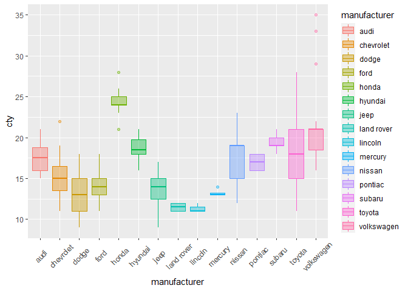

What went wrong?
================
Daniel Krochmal

``` r
knitr::opts_chunk$set(echo = TRUE, error = TRUE)
```

## HW02 Part A

In this document, I will add some examples of some coding mistakes, it
is up to you to figure out why the graphs are messing up.

### First load packages

It is always best to load the packages you need at the top of a script.
It’s another common coding formatting standard (like using the
assignment operator instead of the equals sign). In this case, it helps
people realize what they need to install for the script and gives an
idea of what functions will be called.

It is also best coding practice to only call the packages you use, so if
you use a package but end up tossing the code you use for it, then make
sure to remove loading it in the first place. For example, I could use
`library("tidyverse")` but since this script will only be using ggplot2,
I only load ggplot2.

``` r
library("ggplot2")
library("magrittr") #so I can do some piping
```

### Graph Fail 1

What error is being thrown? How do you correct it? (hint, the error
message tells you)

**The error message is pretty self-explanatory. While %\>% operator
seems to pass mpg argument to data within ggplot function, it cannot be
used interchangeably with + sign, which indicates that we’re adding
another layer to the plot. The error can be corrected by replacing %\>%
with + after a ggplot() function call.**

``` r
data(mpg) #this is a dataset from the ggplot2 package

mpg %>% 
  ggplot(mapping = aes(x = cty, y = hwy, color = "blue")) + 
  geom_point()
```

<!-- -->

### Graph Fail 2

Why aren’t the points blue? It is making me blue that the points in the
graph aren’t blue :\`(

**Removing color = “blue” from the aes() is a solution. We only want to
manually color all the points, not map any aesthetic.**

``` r
ggplot(data = mpg) + 
  geom_point(mapping = aes(x = displ, y = hwy), color = "blue")
```

<!-- -->

### Graph Fail 3

Two mistakes in this graph. First, I wanted to make the the points
slightly bolder, but changing the alpha to 2 does nothing. What does
alpha do and what does setting it to 2 do? What could be done instead if
I want the points slightly bigger?

**In order to make points larger, we should use “size” instead of
“alpha”, which allows us to set the transparency to the object.
Setting it to 2 will not work, because it accepts values between 0 (100%
transparency) and 1 (0% transparency).**

Second, I wanted to move the legend on top of the graph since there
aren’t any points there, putting it at approximately the point/ordered
pair (5, 40). How do you actually do this? Also, how do you remove the
legend title (“class”)? Finally, how would you remove the plot legend
completely?

**legend.position accepts values between 0 and 1, therefore we need to
estimate the coordinates by accounting for the scale range that we’re
using on the plot. The legend title can be removed by adding
theme(legend.title = element\_blank()), Entire legend can be removed by
adding theme(legend.position=‘none’) to the code.**

``` r
mpg %>% 
ggplot() + 
  geom_point(mapping = aes(x = displ, y = hwy, color = class), size = 2) +
    theme(legend.direction = "horizontal") +
    theme(legend.position = c(0.65, 0.85))
```

<!-- -->

``` r
    #theme(legend.title = element_blank())
    #theme(legend.position='none')
```

### Graph Fail 4

I wanted just one smoothing line. Just one line, to show the general
relationship here. But that’s not happening. Instead I’m getting 3
lines, why and fix it please?

**Moving the color to drv mapping from the base (ggplot) to the
geom\_point layer solves the problem. Before this color to drv mapping
was placed in ggplot(), which told geom\_smooth() to map onto these
aesthetics. Removing it to a separate geom\_point() layer tells it to
map only onto x and y.**

``` r
mpg %>% 
ggplot(mapping = aes(x = displ, y = hwy)) + 
  geom_point(mapping = aes(color = drv)) + 
  geom_smooth(se = F) #se = F makes it so it won't show the error in the line of fit
```

    ## `geom_smooth()` using method = 'loess' and formula 'y ~ x'

<!-- -->

### Graph Fail 5

I got tired of the points, so I went to boxplots instead. However, I
wanted the boxes to be all one color, but setting the color aesthetic
just changed the outline? How can I make the box one color, not just the
outline?

**Color only changes the outline (scatter plots are exception here). In
order to change the color of the box, one has to pass the color inside a
“fill” parameter.**

Also, the x-axis labels were overlaping, so I rotated them. But now they
overlap the bottom of the graph. How can I fix this so axis labels
aren’t on the graph?

**Adding “vjust” to theme(axis.text.x = element\_text()) allows to
adjust the vertical position of the axis labels.**

``` r
ggplot(data = mpg, mapping = aes(x = manufacturer, y = cty, fill = manufacturer, color = manufacturer)) + 
  geom_boxplot(alpha = 0.4) + 
  theme(axis.text.x = element_text(angle = 45, vjust = 0.6))
```

<!-- -->
